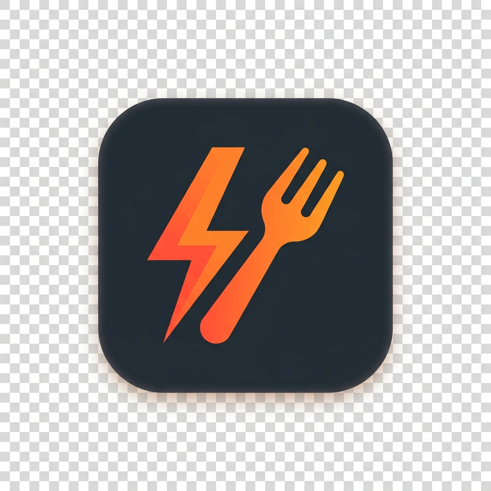

<div align="center">
  
  <h1>🍔 QuickBite Pro</h1>
  <p><strong>Premium Smart Restaurant Ordering & Kitchen Management System</strong></p>
  
  [](https://reactjs.org/)
  [](https://vitejs.dev/)
  [](https://tailwindcss.com/)
  [](https://www.framer.com/motion/)
</div>

<br />

## 🌟 Overview

**QuickBite Pro** is a modern, premium food ordering web application designed for elite dining experiences and seamless kitchen management. Built with cutting-edge web technologies, it features a stunning glassmorphism UI, smooth micro-interactions, and a carefully crafted typography system using `Poppins` and `Inter` fonts for optimal readability and a luxurious feel.

---

## ✨ Key Features

### 🎨 Premium UI / UX
- **Glassmorphism Design:** Beautiful translucent overlays and custom blur effects.
- **Dynamic Animations:** Floating 3D objects, parallax hover effects, and spring-based modal transitions powered by Framer Motion.
- **Curated Typography:** Clean, modern font pairings without heavy/bold text to maintain an elegant and sophisticated aesthetic.
- **Responsive Layout:** Perfectly optimized for all devices, from ultra-wide monitors to mobile screens.

### 👥 Multi-Role Dashboards
- **Customer Dashboard:** Track live orders, manage favorites, view order history, and handle profile settings.
- **Admin/Kitchen Dashboard:** Real-time order monitoring, ticket management, preparation status updates, and revenue metrics.

### 🛒 Seamless Ordering Flow
- **Interactive Menu:** Filterable and categorised food menu (Burgers, Pizzas, BBQ, Drinks, Desserts).
- **Smart Cart Drawer:** Real-time cart calculations with smooth slide-in animations.
- **Quick Checkout:** Streamlined checkout process with multiple payment integrations (e.g., JazzCash, Card, Cash on Delivery).

### 🔐 Secure Authentication
- Custom designed premium login and registration modals.
- Real-time password strength indicators.
- One-click demo access for both Customer and Admin roles.

---

## 🛠️ Technology Stack

| Technology | Purpose |
| :--- | :--- |
| **React 18** | Core UI library for component-based architecture |
| **Vite** | Blazing fast build tool and development server |
| **Tailwind CSS** | Utility-first CSS framework for rapid styling |
| **Framer Motion** | Advanced declarative animation library |
| **Lucide React** | Beautiful, consistent open-source icons |
| **TypeScript** | Static typing for robust and error-free code |

---

## 🚀 Getting Started

### Prerequisites
Make sure you have [Node.js](https://nodejs.org/) (v18 or higher) installed on your machine.

### Installation

1. **Clone the repository:**
   ```bash
   git clone https://github.com/rabiasiddique-dev/QuickBite-Pro-Food-Ordering-Web-App.git
   ```

2. **Navigate to the project directory:**
   ```bash
   cd QuickBite-Pro-Food-Ordering-Web-App
   ```

3. **Install dependencies:**
   ```bash
   npm install
   ```

4. **Start the development server:**
   ```bash
   npm run dev
   ```

5. **Open in browser:**
   Open `http://localhost:5173` to view it in your browser.

---

## 📂 Project Structure

```text
├── public/                 # Static assets (logo, favicon)
├── src/
│   ├── components/         # Atomic design (atoms, molecules, organisms)
│   ├── contexts/           # Global state (AuthContext, CartContext, ThemeContext)
│   ├── data/               # Mock data for menus, reviews, orders
│   ├── pages/              # Application views (Landing, Menu, Dashboards)
│   ├── services/           # API and database service integrations
│   ├── types/              # TypeScript interfaces and types
│   ├── index.css           # Global CSS overrides and Tailwind utilities
│   └── main.tsx            # Application entry point
├── tailwind.config.js      # Tailwind theme configuration
└── vite.config.ts          # Vite configuration
```

---

## 💅 Design Guidelines

This project strictly follows a custom design system:
- **Heading Fonts:** `Poppins` (Used for Logos, Hero sections, and Headings)
- **Body Fonts:** `Inter` (Used for Paragraphs, standard text, and UI elements)
- **No-Bold Rule:** The application strictly avoids `font-bold` utility classes to preserve a light, elite, and premium digital aesthetic across the entire ecosystem. Maximum font weight used is `500` (Medium).

---

<div align="center">
  <p>Crafted with ❤️ for Food Lovers.</p>
</div>
